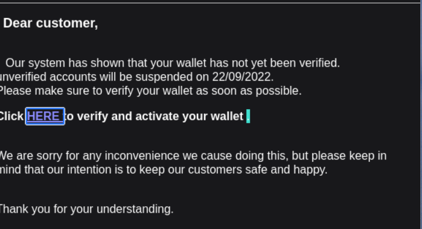
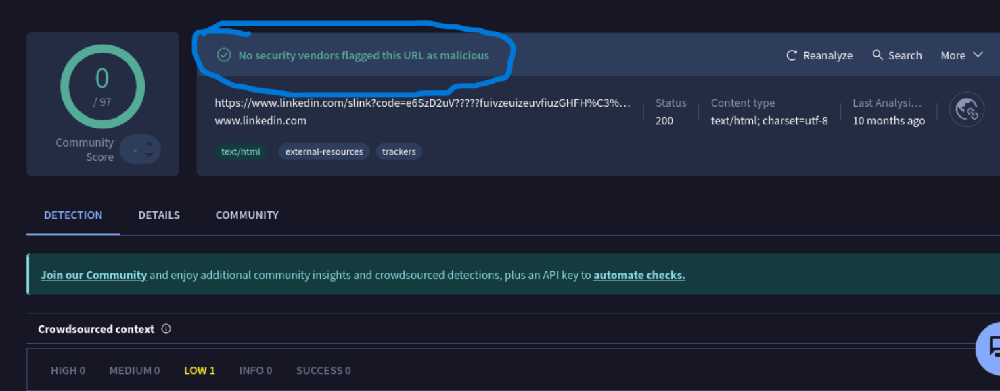
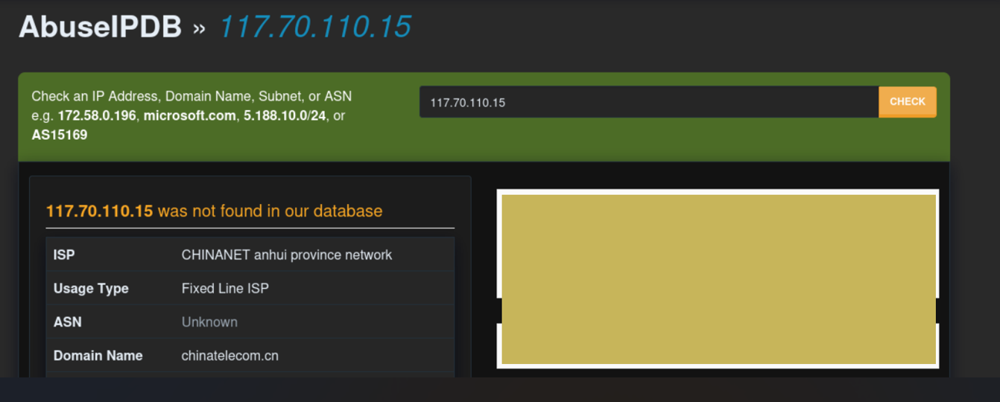
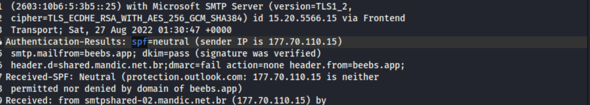
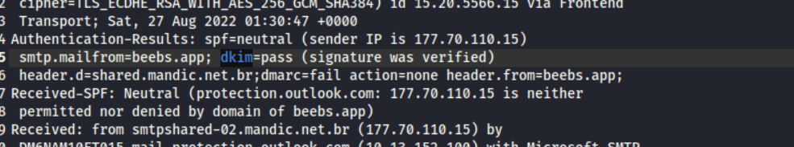
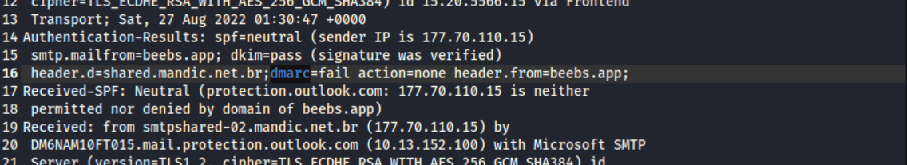

# 📧 Phishing Email Analysis Report

## 📌 Overview
This project demonstrates a structured analysis of a suspected phishing email using real-world techniques and tools.

The goal is to:
- Identify indicators of compromise (IOCs)
- Validate email authenticity
- Detect inconsistencies in email headers and content
- Provide a final security assessment

---

## 🧪 Environment
- Analysis Machine: Kali Linux VM
- Tools Used:  
  - VirusTotal  
  - AbuseIPDB  
  - Email Header Analyzer  
- Scope: Controlled lab environment (no real users targeted)

---

## ⚠️ Disclaimer
This project is strictly for educational and cybersecurity research purposes only.  
All analysis was conducted in a controlled lab environment.

---

# 🔍 Step 1: Initial Email Review

The email content was reviewed for common phishing characteristics.

### Observations:
- Generic greeting ("Dear Customer")
- Urgency ("verify as soon as possible")
- Suspicious call-to-action link
- Psychological pressure tactics

---

# 🔗 Step 2: URL Analysis (VirusTotal)

The embedded link in the email was extracted and analyzed using VirusTotal.

### Result:
- No detections from security vendors
- URL not previously flagged as malicious

### Insight:
This indicates the attacker may be using:
- Newly created infrastructure
- Previously unreported phishing domains

---

# 🌐 Step 3: Sender IP Analysis (AbuseIPDB)

The sender's IP address was extracted from the email headers and analyzed.

### Result:
- IP not found in AbuseIPDB database
- No prior abuse reports

### Insight:
Attackers often use:
- Clean IP addresses
- Compromised but unreported systems

---

# 📨 Step 4: Email Header Analysis

Full email headers were analyzed to verify authentication mechanisms.

---

## 🧾 4.1 SPF (Sender Policy Framework)

### Result:

SPF =Neutral

### Meaning:
The sender's IP is neither explicitly authorized nor denied.

👉 This does NOT guarantee legitimacy.

- 
---

## 🔐 4.2 DKIM (DomainKeys Identified Mail)

### Result:

DKIM = Pass

### Meaning:
The email content was cryptographically signed and not altered in transit.

👉 However, DKIM alone does not confirm the sender is trustworthy.

- 

## 🚨 4.3 DMARC (Domain-based Message Authentication)

### Result:
- DMARC = Fail

### Meaning:
The email failed alignment checks between:
- From address
- SPF/DKIM domains

👉 This is a strong indicator of phishing.

---

# # 📬 Step 5: Return-Path Analysis

The Return-Path header was examined to identify the actual sending domain.

### Finding:
- **Return-Path:** hello@beebs.app

### Insight:
- The Return-Path matches the visible "From" address
- This indicates there is **no spoofing at the envelope level**
- The sending domain appears consistent across headers

👉 However, this does NOT guarantee legitimacy, as attackers can still use domains they control or compromised infrastructure.

---

### 🔍 Analyst Note

Even when:
- From address = Return-Path  
- DKIM = Pass  

The email can still be malicious.

In this case, further indicators (e.g., **DMARC failure and email content**) must be used to determine risk.

---

# ⚖️ Step 6: Correlation of Findings

| Indicator            | Result        | Interpretation |
|---------------------|--------------|----------------|
| URL Check           | Pass         | Possibly new or unreported |
| IP Reputation       | Pass         | Clean or low reputation |
| SPF                 | Neutral      | No strict validation |
| DKIM                | Pass         | Integrity confirmed |
| DMARC               | Fail         | ❗ Domain mismatch detected |
| Return-Path         | Pass         | Matches sender domain (no spoofing detected)|

---

# 🚨 Final Assessment

Despite passing some checks (URL and IP reputation), the email is highly likely to be malicious.

### Key Reasons:
- DMARC failure indicates domain misalignment
- Social engineering tactics present
- Suspicious call-to-action link
- Return-Path reveals alternative sending domain

👉 Conclusion:  
This email demonstrates how phishing attacks can bypass basic security checks and still appear legitimate.

---

# 🛡️ Recommendations

- Do not rely on a single indicator (e.g., URL or IP reputation)
- Always verify DMARC alignment
- Educate users on phishing techniques
- Implement email security gateways with strict policies

---

# 📚 Key Takeaways

- Passing checks ≠ safe email  
- Attackers use clean infrastructure  
- Header analysis is critical  
- DMARC is a strong detection signal  

---

# 👨‍💻 Author
Tolulope R. Arowobusoye

Cybersecurity Analyst.
